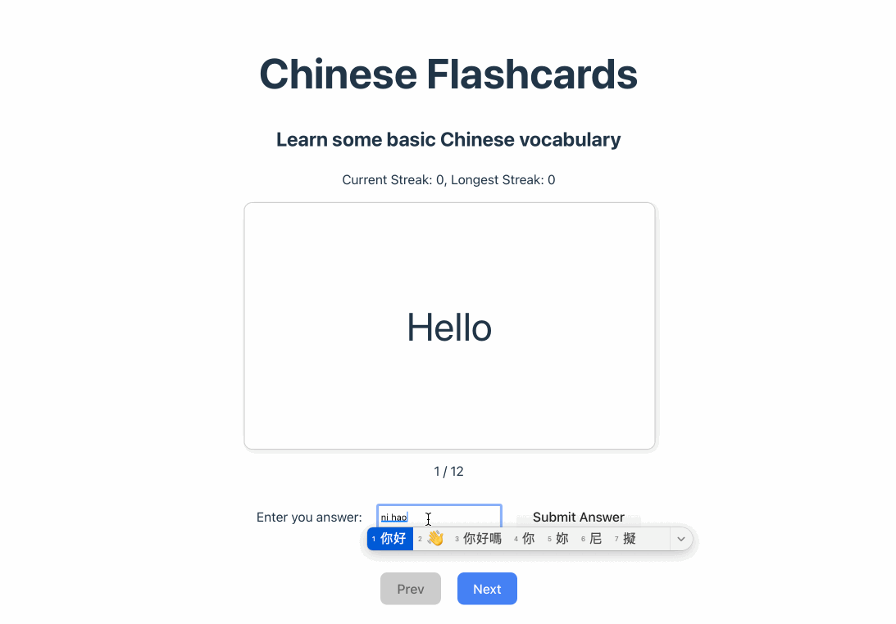

# Web Development Project 3 - *Chinese Flashcards*

Submitted by: **Cheryl Chen**

This web app displays flashcards of miscellaneous Chinese vocabulary to help you learn Chinese. You can use the input to enter an answer and check your answer by flipping the card.

Time spent: **2** hours spent in total

## Required Features

The following **required** functionality is completed:

- [X] **The user can enter their guess in a box before seeing the flipside of the card**
- [X] **Clicking on a submit button shows visual feedback about whether the answer was correct or incorrect**
- [X] **A back button is displayed on the card and can be used to return to the previous card in a set sequence**
- [X] **A next button is displayed on the card and can be used to navigate to the next card in a set sequence**

The following **optional** features are implemented:

- [ ] A shuffle button is used to randomize the order of the cards
- [ ] A user's answer may be counted as correct even when it is slightly different from the target answer
- [X] A counter displays the user's current and longest streak of correct responses
- [ ] A user can mark a card that they have mastered and have it removed from the pool of answers as well as added to a list of mastered cards

The following **additional** features are implemented:

* [ ] List anything else that you added to improve the site's functionality!

## Video Walkthrough

Here's a walkthrough of implemented user stories:

<!-- Replace this with whatever GIF tool you used! -->
GIF created with LICEcap  
<!-- Recommended tools:
[Kap](https://getkap.co/) for macOS
[ScreenToGif](https://www.screentogif.com/) for Windows
[peek](https://github.com/phw/peek) for Linux. -->

## Notes

I had trouble updating the longest streak because the longest streak depended on the current streak. Both are useState variables, and I was trying to update both variables in the same callback function. The longest streak was updating based on an old value of current streak since React's useState updates asynchronously. I learned to use functional updates when multiple state updates happen in the same function.

## License

    Copyright [2025] [Cheryl Chen]

    Licensed under the Apache License, Version 2.0 (the "License");
    you may not use this file except in compliance with the License.
    You may obtain a copy of the License at

        http://www.apache.org/licenses/LICENSE-2.0

    Unless required by applicable law or agreed to in writing, software
    distributed under the License is distributed on an "AS IS" BASIS,
    WITHOUT WARRANTIES OR CONDITIONS OF ANY KIND, either express or implied.
    See the License for the specific language governing permissions and
    limitations under the License.